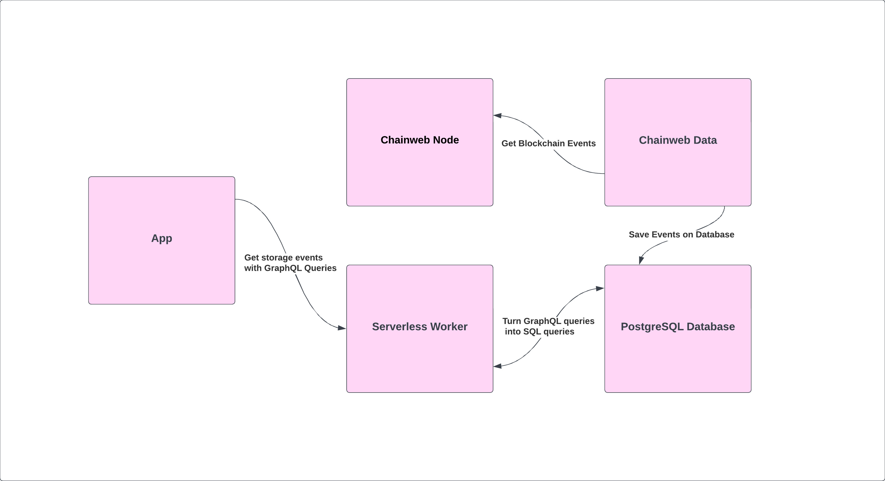

# Indexer
The "indexer" package is a set of services designed to index and track events on the Kadena blockchain. It provides a comprehensive solution for efficiently collecting, storing, and processing events, enabling subsequent analysis and queries.

## Components
The "indexer" consists of the following components:

*PostgreSQL Database*: A relational database is used to store indexed events and other relevant information. The database schema is updated to filter and save only the desired modules in the database.

*Chainweb-data*: This service is responsible for collecting events from the Kadena blockchain and inserting them into the database. The latest available image from the Docker website is used to run this service.

*Chainweb-node*: This service runs a Chainweb node to receive events from the blockchain. Specific configuration is required to establish the connection between the "chainweb-data" service and the "chainweb" node.

*Serveless*: A serveless component is used to provide a query interface to the indexed events in the database. This component allows for efficient queries and retrieval of the indexed data.

## Infrastructure Management with Terraform
The entire infrastructure for the "indexer" package is created and managed using Terraform. Terraform provides a declarative approach to infrastructure provisioning, allowing you to define and automate the deployment of resources needed for the indexer.

With Terraform, you can define the desired state of your infrastructure using code, and Terraform will handle the provisioning and configuration of the necessary resources, such as the PostgreSQL database, Docker images, and serveless components. This ensures that your infrastructure remains consistent and reproducible across deployments.

To manage the indexer infrastructure with Terraform, you can use the provided Terraform configuration files, which specify the required resources, their dependencies, and any necessary configurations. By running Terraform commands, such as terraform apply, you can create, update, or destroy the indexer infrastructure as needed.

By leveraging Terraform for infrastructure management, you can easily scale, modify, and version your indexer infrastructure, providing a reliable and efficient foundation for indexing and analyzing events on the Kadena blockchain.

