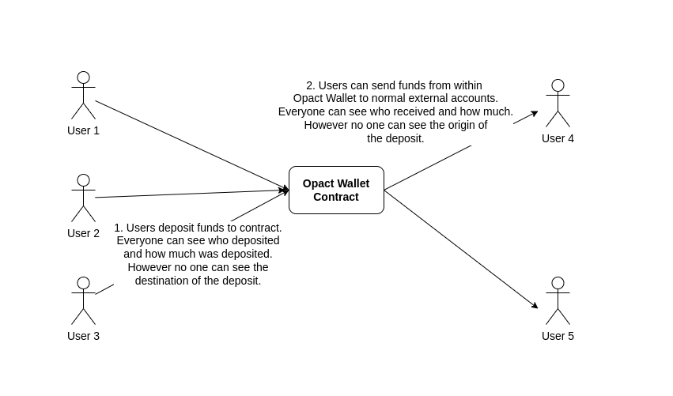
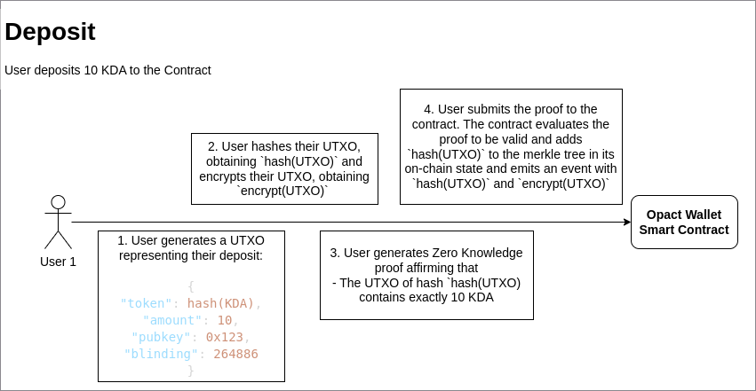
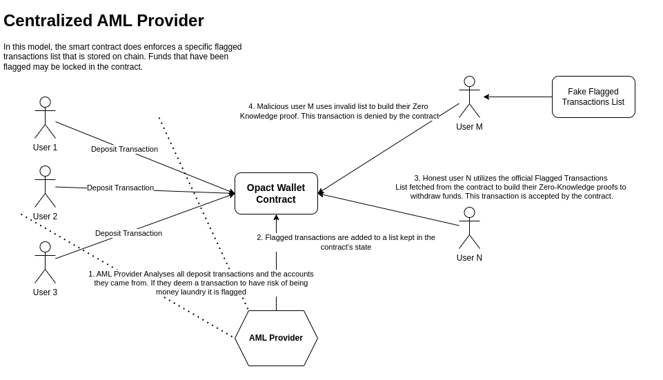
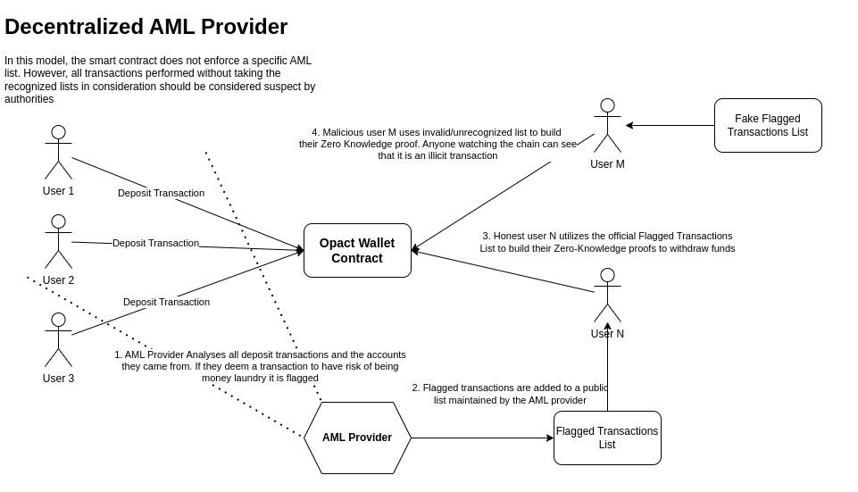

# Opact Wallet - Kadena Blockchain

This repo contains the source code for the Opact Wallet, a web-based ZK-powered private wallet for the Kadena blockchain with innovative Anti Money Laundry features.

The goal of the wallet is to provide users with an easy to use privacy tool that allows them to:
- Own assets without anyone being able to see their balance
- Receive payments without revealing their finances to the payer
- Make payments without revealing the source wallet or its balance

The app should therefore implement a bank secrecy layer on blockchain.

At the same time, the wallet must have a mechanism to disallow illicit actors from making use of it, without any loss to regular user's privacy, security or decentralization.

## How it works
The protocol works as a smart contract in the Kadena Blockchain that carries a zero knowledge circuit within it. Opact Wallet is an abstracted wallet - that means it is a single smart contract that receives funds from all users that use it. The smart contract is responsible for keeping track of the balance of each user, and for allowing users to withdraw their funds. 

This means that the only information that is effectively stored in the blockchain are the transactions depositing and withdrawing from the Opact Wallet smart contract - because of zero knowledge proofs, however, it is impossible for an external observer to infer who is paying whom and who is the real owner of assets.




## Zero Knowledge Circuit
The key to making the protocol work is the zero knowledge circuit. The circuit is a mathematical proof that allows the smart contract to verify that a user is allowed to withdraw funds from the Opact Wallet without revealing any information about the user's balance or the source of the funds.

### UTXOs
The system is based on Unspent Transaction Outputs (UTXOs) - a concept pioneered by [Bitcoin](https://river.com/learn/bitcoins-utxo-model/) and later applied in a zero knowledge context by [Zcash](https://zcash.readthedocs.io/en/latest/rtd_pages/shield_coinbase.html). This explanation assumes understanding of the UTXO model.

Each UTXO in Opact Wallet is composed of the following variables:
```JSON
{
    "token": "reference to the token type that the UTXO represents",
    "amount": "amount of tokens in the UTXO",
    "pubkey": "public key of the wallet of the owner of this UTXO",
    "blinding": "randomly generated value"
}
```
- `pubkey` refers to the key-pair that represents the Opact Wallet account belonging to the user
- `token` is the hash of a reference to the contract of the token that is stored in the UTXO. This is used to allow the Opact Wallet to store multiple tokens and different asset types such as NFTs.
- `amount` is the amount of tokens stored in the UTXO
- `blinding` is a randomly generated value that is used to hide the amount of tokens stored in the UTXO. If there were no blinding factor, UTXOs owned by the same wallet with the same amount of funds would always be equal.

### Depositing assets
The way through which Opact Wallet keeps balances private is by storing all state within a single Merkle Tree. UTXOs are not stored in the merkle tree as plain text though, they are hashed using the Poseidon Hash. In this way it is impossible to infer the assets that they encode for any observer.

When users deposit assets they simply create new UTXOs with the values deposited and only submit the hashes publicly on chain. The smart contract then adds the UTXOs to the merkle tree and updates the root hash.

This setup only keeps hashes of the UTXOs on-chain which means there is no way to infer the value, type of asset or owner of each UTXO. This generates a powerful privacy system, but it also generates a problem: how can the users keep track of their own balance if they don't know the value of their UTXOs? To solve this problem, every time a user deposits funds, they also send to the contract an encrypted version of the UTXO, using their wallet's public key as the encryption key. This way, the user can decrypt the UTXO and know its value, but no one else can.



### Withdrawing assets
The user can then withdraw funds by submitting a zero knowledge proof that they own a UTXO with the amount of funds they want to withdraw. One of the byproducts of these proofs are `nullifier` values, these values are deterministic for each UTXO and are saved to the contract to hinder double spends of UTXOs - if values were simply removed from the merkle tree then it would be easy to infer their original owner and break the anonymity of the protocol.

To perform a withdraw the user provide a Zero Knowledge proof showing that:
- They know the private key of the wallet that owns the UTXO
- They know the unencrypted data of the UTXOs they intend to spend
- The value of the withdrawal + the value of the change UTXOs being created is equal to the value of the UTXO they are spending
- The UTXOs being spent have not been flagged as malicious by the AML policy
- The UTXOs being spent have not been spent before

### Anti Money Laundry policy
Opact Wallet includes a framework to allow security data providers to flag UTXOs as malicious. Whenever a UTXO is marked as malicious the circuit can enforce it not to be spendable.
This allows, for instance, all deposits that are flagged as coming from smart contract hacking to be automatically blocked from spending. 

This works by requiring all withdraw transactions to submit a list of flagged illicit transactions - the ZK circuit evaluates that the UTXOs being used do not belong to that list. There are 2 options on how to enforce this:
1. Centralized AML provider - The contract designates a specific account as the AML provider and allows that account to update its on-chain list of malicious UTXOs. Whenever a user submits a ZK proof to withdraw, the contract checks that the list used to build the proof matches the list currently stored in the contract's state.



2. Decentralized AML provider - The contract doesn't hold any list of flagged transactions in its state. However, different AML providers can provide public lists and frontends providing access to the contract need to enforce one of those lists. Users that submit invalid lists with their withdraw transactions chain are able to withdraw their assets, however it is publicly visible that they did so by not following the AML policy and can easily be tracked by authorities.



The project chose, for its initial implementation, to not enforce any particular AML protocol in the smart contract level. The security is instead being enforced on the frontend level. This allows for a more flexible implementation and for the possibility of multiple AML providers to coexist.

The frontend hosted by Opact itself is going to chose a specific AML provider. It is possible to identify all transactions that adhere to the AML policy and separate them from eventual rogue transactions directly on chain. Thus bad actors are not able to take advantage of the protocol.