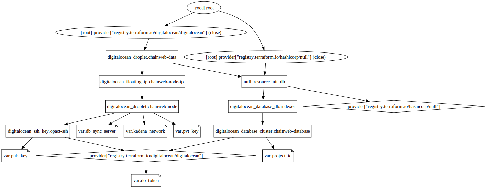

# Terraform

This repository contains Terraform code for deploying infrastructure on AWS.

The code provisions resources such as Droplets, SSH keys, and a database cluster. The infrastructure is designed to support the deployment of a Chainweb node and data components.

## Prerequisites

Before running this Terraform code, make sure you have the following prerequisites set up:

- Terraform: Install Terraform on your local machine. You can download it from the official website: [Terraform Downloads](https://developer.hashicorp.com/terraform/downloads).

- AWS Account: Create an account on [AWS](https://aws.amazon.com/). You will need an API token for authentication, which you can obtain from the AWS control panel.

- SSH Key Pair: Generate an SSH key pair if you don't have one already. The private key will be used for authentication to the Droplets.

## Usage

Follow the steps below to use this Terraform code:

- Clone the repository: Clone this repository to your local machine.

- Set up Terraform variables: Create a file named .tfvars in the root directory as the Terraform code. Add the following content to the file and replace the placeholder values with your own:
```
aws_access_key = "AWS_ACESS_KEY"
aws_secret_key = "AWS_SECRET_KEY"
db_password = "DATABASE_PASSWORD"
```

- Initialize Terraform: Open a terminal or command prompt, navigate to the cloned repository directory, and run the following command to initialize Terraform:

```
pnpm terraform install
```

- Review the execution plan: Run the following command to see the execution plan and ensure that everything looks correct:

```
pnpm terraform plan
```
Verify that the planned changes match your expectations.

- Apply the Terraform configuration: Once you're ready to provision the infrastructure, run the following command:

```
pnpm terraform apply
```

- Wait for the deployment: Terraform will start provisioning the resources on AWS. Wait for the process to complete.

- Access the deployed infrastructure: After the deployment is successful, you can access the deployed resources, such as the Droplets, using SSH. Make sure to use the appropriate SSH key and the IP addresses of the created Droplets.

- Cleanup and destroy: To clean up and destroy the created infrastructure, run the following command:

```
pnpm terraform destroy
```

## Additional Information

- The Terraform code uses the AWS provider, which is defined in the *required_providers* block in the *terraform* configuration section.

- The SSH key paths and AWS access tokens are defined as variables in the *variable* blocks. You can customize these values in the *variables.tf* file or by using command-line flags when executing Terraform commands.

- The code provisions a AWS SSH key named *opact-ssh* using the public key located at the path specified in the *pub_key* variable. Make sure the file exists and contains the correct public key.

- The code creates a AWS database cluster named "chainweb_database" using PostgreSQL version 15. Adjust the cluster configuration as needed by modifying the *resource "aws_db_instance" "chainweb_database"* block.

- EC2 are provisioned using the Ubuntu 22.04 x64 image in the "us-east-1" region. Adjust the image, region, size, and other configurations in the *resource "aws_instance" "chainweb_data"* and *resource "aws_instance" "chainweb_node"* blocks to fit your requirements.

## Terraform Graph


